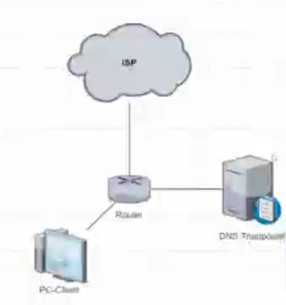

# Review Video OJM 2024 "DNSover HTTPS"
Minggu 7 September 2025

# Pendahuluan
  
1. Salam Pembuka  
2. Perkenalan diri masing-masing  
3. Menjelaskan sebagai perwakilan sekolah   
4. Menyebutkan nomor peserta  
5. Menyebutkan judul/tema  
6. Menjelaskan tentang tema yang akan di bahas  
	DoH (DNS over HTTPS) merupakan suatu protokol yang digunakan untuk resolusi penamaan domain dengan mengunakan protokol https  
7. Tujuan  
	Untuk menjaga privasi dan keamanan pengguna dengan mencegah serangan man in the middle.   
8. Dampak negatif dan positif  
9. Membahas topik terkait   
	Berita, statistik, judi online di Indonesia  
10. Cara kerja  
11. Perbandingan tanda dan dengan DoH  
  
# Isi  
1. Penjelasan TOPOLOGI  
  
2. Konfigurasi di Mikrotik  
3. Tidak mengunakan use peer dns di dhcp client  
4. Set DNS Static, mengunakan DNS Kominfo  
5. Membuat daftar domain provider DoH yang akan di block (Di address list, Mencontohkan 4)  
6. Membuat NAT untuk redirect semua trafik yg bukan dari DNS di Mikrotik  
7. Urutan NAT   
8. Membuat filter rules. Untuk mendrop semua trafik address list  
9. Menghapus cache DNS di Mikrotik  
10. Menghapus cache pada Browser  
11. Percobaan/pengetesan  
  
# Penutup  
1. Kekurangan dan Kelebihan  
2. Tujuan (mendukung internet sehat)  
3. Salam penutup  

